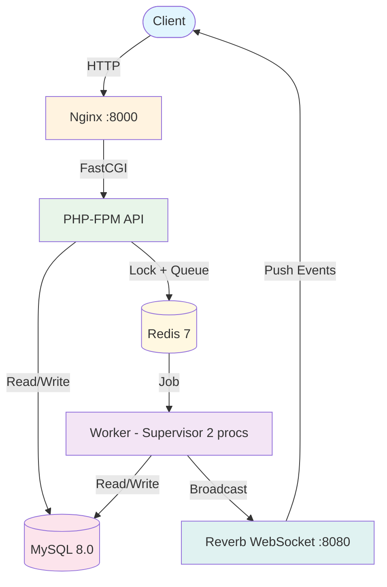
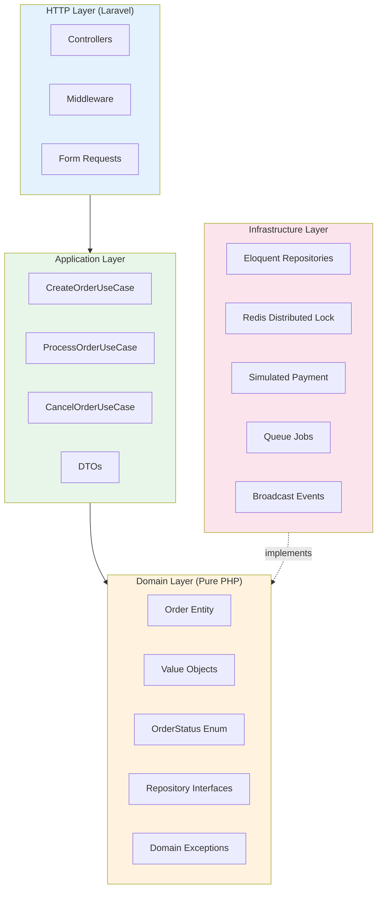
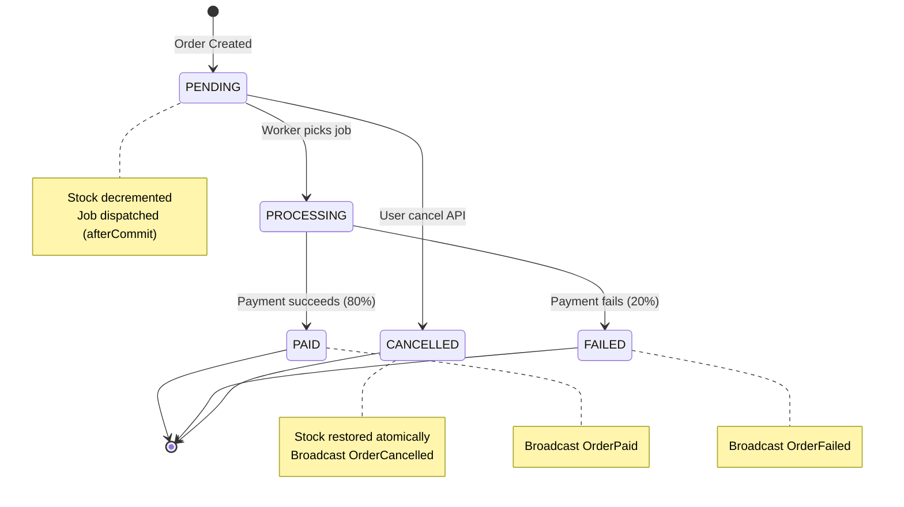
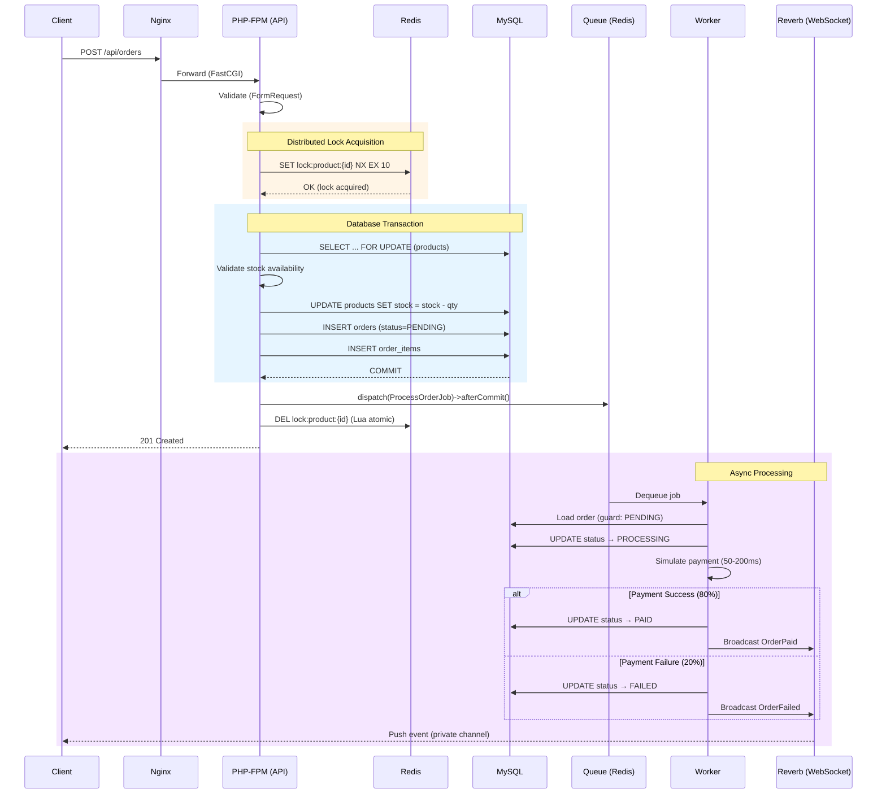
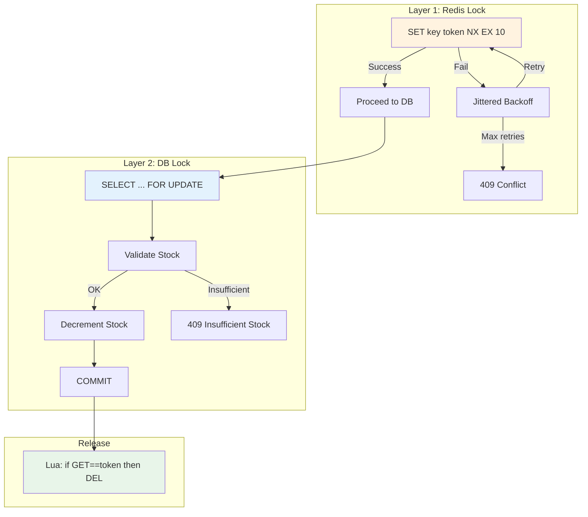
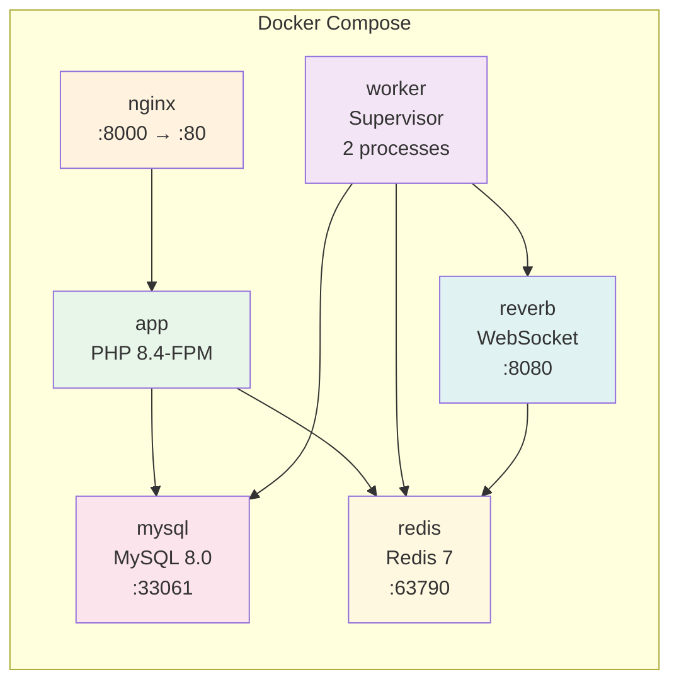
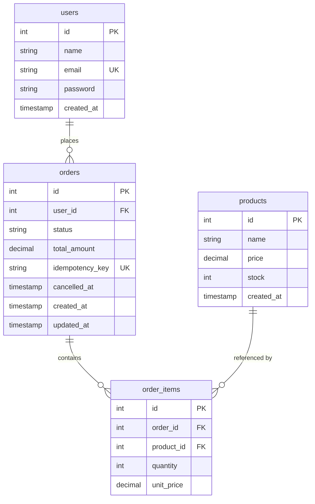
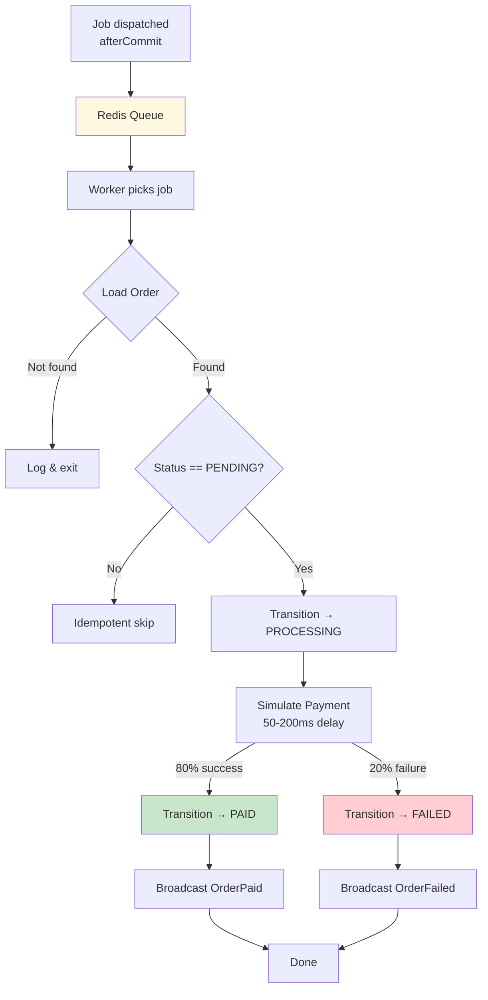

# Architecture Documentation

> Detailed architecture diagrams for the Distributed Order Processing System.
> These diagrams supplement the [README](../README.md) with visual references.

---

## System Architecture Overview

---

## Clean Architecture Layers

**Dependency Rule**: All arrows point inward. Infrastructure implements Domain interfaces, never the reverse.

---

## Order Lifecycle State Machine

---

## Request Flow (Create Order)

---

## Distributed Locking Strategy

---

## Docker Infrastructure

---

## Database Schema (ER Diagram)

---

## Queue & Worker Pipeline

---

*These diagrams are rendered natively on GitHub. For local viewing, use a Mermaid-compatible Markdown viewer or [mermaid.live](https://mermaid.live).*
